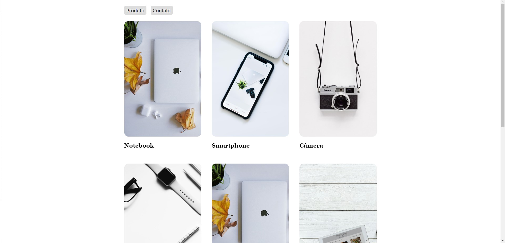

<h1>Rotas React </h1>

<!-- LINKS -->

 <h2> Sumário</h2>
  <a href="#fotos">Fotos</a> -
  <a href="#sobre">Sobre o Projeto</a> - 
  <a href="#tec">Tecnologias</a>

 

<!-- FOTOS -->

    <h2> 📸 Fotos </h2>
        
          
       
 <h2> 📱 Responsivo </h2>
    
          

<!-- SOBRE -->

    <h2> 📝 Sobre o Projeto </h2> 
    

      Projeto feito para estudar e testar as rotas com o React Router Dom. Onde no projeto você consegue acessar
      uma lista de produtos (puxando os dados através da API ranek do curso da origamid) e quando você clica no 
      produto desejado, você é redirecionado para a página daquele produto em específico, onde é feita mais uma requisição
      e assim puxando os dados daquele produto em específico. O projeto também foi feito utilizando o styled components
      OBS: Criei um custom hook chamado useFetch, onde o mesmo puxa faz o fetch dos dados de acordo com a url passada no argumento do mesmo.
    

 
 <h3 align="center">Link do Projeto <a href="https://lucasfrancobn.github.io/Rotas-React/">CLIQUE AQUI</a></h3>

 

<!-- TECNOLOGIAS -->

<h2> 🖥️ Tecnologias</h2>
    
 ✔️ ReactJS 

    
 ✔️ React Router DOM 

    
 ✔️ Styled Components 

